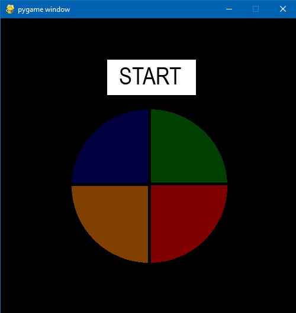

# Projeto de Jogo GENIUS
> pequeno projeto do famoso jogo genius onde você deve seguir a sequência apresentada até onde conseguir lembrar.

Genius é o famoso jogo de memória onde cada vez que você acerta, a sequência vai sendo implementada até um ponto onde é impossível lembrar qual a sequência certa de cores. Este projeto é bastante interessante e trabalha com interface gráfica, construção de jogos e randomização de jogada através do módulo RANDOM.

---

## Módulos necessários
Foram utilizados os módulos pygame para construção do jogo em si e playsound para a música de fundo, além disso foi utilizado o módulo RANDOM para fazer as jogadas e time.
Para instalar o pygame:
`pip install pygame`
Para instalar o playsound:
`pip install playsound`

## Usos
Este projeto é um bom inicio para aprender a criar pequenos jogos simples pelo python e entender um pouco de mecânicas de construção dos mesmos. Além de ser um excelente jeito de passar o tempo jogando.

## Meta
Gregory Wells de Carvalho Barteles - gregorywells93@gmail.com.